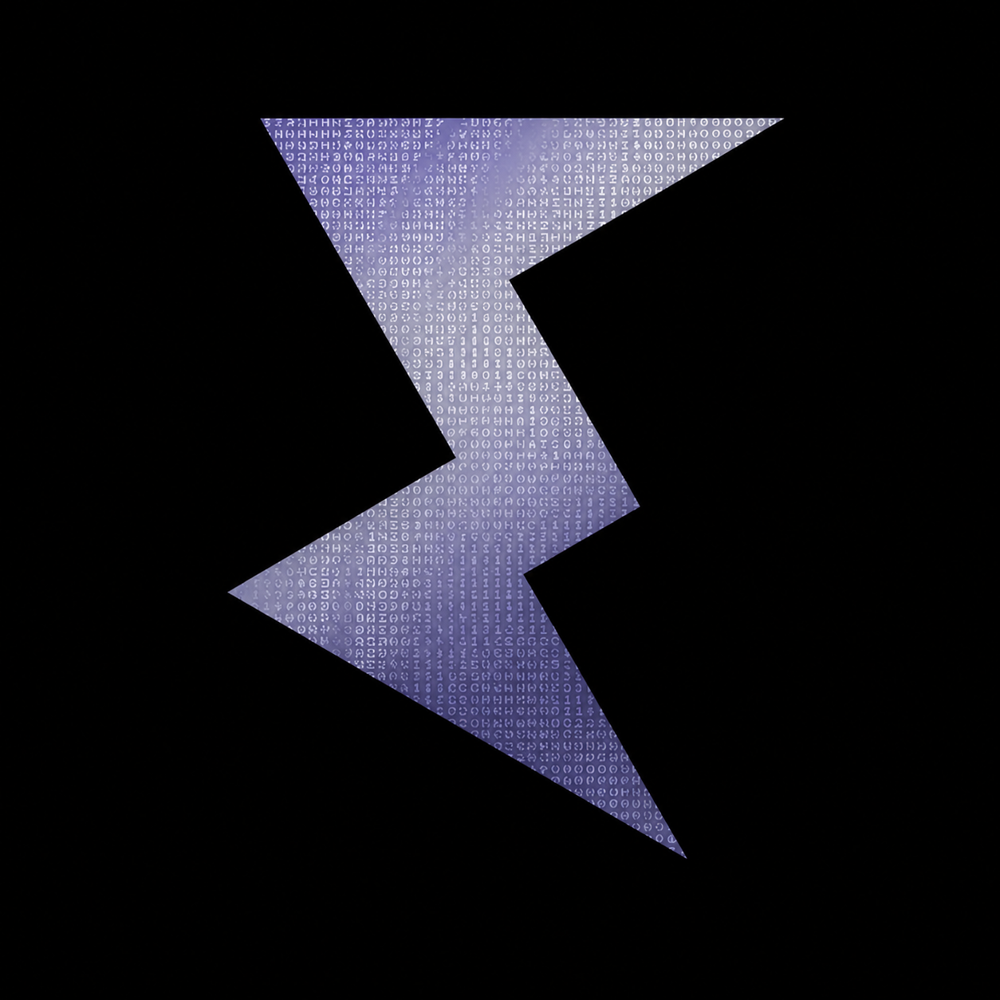

<p align="center">
  
</p>

<h1 align="center">Electroplix Design System</h1>

<p align="center">
  <strong>159 production-grade React 19 components · 18 categories · AI-builder ready</strong>
</p>

<p align="center">
  <!-- <a href="https://github.com/electroplix/Design-System/actions"></a> -->
  <a href="https://github.com/electroplix/Design-System/actions">
    
  </a>
  <a href="https://www.npmjs.com/package/@electroplix/components"></a>
  <a href="https://github.com/electroplix/Design-System/blob/main/LICENSE"></a>
  
  
  
</p>

---

## Overview

Electroplix Design System is a modular, open-source collection of **parametric UI components**, design tokens, and tooling built for modern React applications. Every component is config-driven, tree-shakeable, and validated against **Next.js 15.3.8** and **Next.js 16.x** for full SSR/RSC compatibility.

```bash
pnpm add @electroplix/components
```

---

## ✨ Highlights

| Feature | Details |
|:--------|:--------|
| **158 Components** | Across 18 categories — navigation, hero, buttons, forms, content, data-display, ecommerce, lists-cards, marketing, media, miscellaneous, modals, onboarding, search, site-identity, social, user-accounts, blog |
| **React 19** | Built on the latest React with full concurrent features support |
| **Next.js 15 & 16** | SSR-validated with dedicated harness apps for both major versions |
| **AI-Builder Metadata** | Rich JSON definitions with placement hints, pairing suggestions, and page-type mappings — designed for LLM agents and vibe-coding tools to understand and assemble UIs |
| **Zero Runtime Dependencies** | Lightweight ESM bundle (~173 kB packed) with full tree-shaking |
| **TypeScript** | Complete type definitions emitted with every build |
| **Biome** | Ultra-fast linting & formatting — no ESLint/Prettier overhead |
| **Nx Monorepo** | Cached builds, affected-only testing, and dependency graph visualization |

---

## 🚀 Quick Start

```bash
# Prerequisites: Node ≥24, pnpm ≥9

# 1. Clone & install
git clone https://github.com/electroplix/Design-System.git
cd Design-System
pnpm install

# 2. Build everything
pnpm build

# 3. Launch the interactive showcase
pnpm nx dev vite-showcase
# → http://localhost:5173

# 4. Run tests
pnpm test
```

---

## 📂 Repository Structure

```
├── packages/components/        # @electroplix/components — the core library
│   ├── src/components/         # 158 components across 18 category folders
│   ├── metadata/               # AI-ready JSON definitions per category
│   ├── dist/                   # Built ESM + type declarations
│   └── scripts/                # Metadata sync & post-build helpers
├── examples/
│   ├── vite-showcase/          # Full interactive gallery (all 158 components)
│   ├── nextjs15-e2e/           # Next.js 15.3.8 SSR validation app
│   └── nextjs16-e2e/           # Next.js 16.x SSR validation app
├── e2e/components-e2e/         # Playwright end-to-end tests (18 routes)
├── docs/                       # Architecture decision records
├── .github/workflows/          # CI + Release automation
├── biome.json                  # Linter & formatter config
└── nx.json                     # Monorepo orchestration
```

---

## 🖼 Showcases

| App | Stack | Command | Port |
|:----|:------|:--------|:-----|
| **Gallery** | Vite + React 19 | `pnpm nx dev vite-showcase` | 5173 |
| **Next.js 15** | Next.js 15.3.8 | `pnpm nx dev nextjs15-e2e` | 3098 |
| **Next.js 16** | Next.js 16.x | `pnpm nx dev nextjs16-e2e` | 3099 |
| **Storybook** | Storybook 8 | `pnpm nx storybook components` | 6006 |

---

## 🛠 Commands

| Command | Description |
|:--------|:------------|
| `pnpm build` | Build all packages (Nx cached) |
| `pnpm test` | Unit tests (Jest, 172 specs) |
| `pnpm test:e2e` | Playwright E2E against showcase |
| `pnpm lint` | Biome lint check |
| `pnpm lint:fix` | Auto-fix lint issues |
| `pnpm format` | Format codebase |
| `pnpm ci:check` | Strict CI validation (lint + format) |
| `pnpm release:dry` | Preview next version & changelog |
| `pnpm publish:dry` | Full publish dry-run with safeguards |
| `pnpm graph` | Visualize dependency graph |

---

## 🚀 Publishing & Releases

Automated via **Nx Release** + **GitHub Actions**. On every push to `main` that touches `packages/components`:

1. **Validate** — lint, test, build
2. **Version** — conventional commits determine semver bump
3. **Changelog** — auto-generated from commit history
4. **Tag & Release** — GitHub Release with full notes
5. **Publish** — `npm publish --provenance --access public`

### Setup Requirements

| Secret | Purpose |
|:-------|:--------|
| `NPM_TOKEN` | Classic Automation token from [npmjs.com](https://www.npmjs.com/) |
| `GITHUB_TOKEN` | Auto-provided by GitHub Actions |

### Conventional Commits

| Prefix | Release |
|:-------|:--------|
| `fix:` | Patch (0.0.x) |
| `feat:` | Minor (0.x.0) |
| `feat!:` / `BREAKING CHANGE:` | Major (x.0.0) |

### Manual Verification

```bash
pnpm release:dry    # Preview version bump
pnpm publish:dry    # Full safeguard dry-run
```

---

## 🍱 Component Categories

| # | Category | Count | Examples |
|:--|:---------|:------|:---------|
| 1 | Navigation | 11 | PrimaryNav, SideDrawerNav, Breadcrumbs |
| 2 | Hero | 7 | StaticHero, AnimatedHero, VideoHero |
| 3 | Buttons | 11 | PrimaryButton, GhostButton, IconButton |
| 4 | Forms | 14 | TextInput, SelectDropdown, FormShell |
| 5 | Content | 7 | HeadingSection, FAQ, ArticleLayout |
| 6 | Data Display | 11 | StatsCard, DataTable, BadgeGroup |
| 7 | Ecommerce | 10 | ProductCard, CartDrawer, CheckoutForm |
| 8 | Lists & Cards | 8 | CardGrid, FeatureList, ProfileCard |
| 9 | Marketing | 10 | ComparisonTable, StatsCounter, HowItWorks |
| 10 | Media | 12 | ImageGallery, MapEmbed, MasonryGrid |
| 11 | Miscellaneous | 8 | Divider, Banner, Placeholder |
| 12 | Modals | 9 | GenericModal, SlideOver, ConfirmDialog |
| 13 | Onboarding | 6 | Stepper, ProductTour, WelcomeFlow |
| 14 | Search | 6 | CommandPalette, FilterBar, SearchInput |
| 15 | Site Identity | 6 | Logo, Footer, CopyrightNotice |
| 16 | Social | 7 | ShareButtons, SocialFeed, ProfileWidget |
| 17 | User Accounts | 7 | AuthForm, ProfileSettings, RoleBadge |
| 18 | Blog | 9 | PostPreview, AuthorCard, ReadingProgress |

---

## 🤖 AI Builder Integration

Electroplix components ship with a **complete metadata layer** (`packages/components/metadata/`) specifically designed for **LLM agents and vibe-coding tools**. When developers use AI assistants (Cursor, Copilot, Kiro, v0, Bolt, etc.) to build UIs with `@electroplix/components`, the metadata gives the model full context about every component — props, placement logic, page-type affinity, and pairing suggestions — enabling accurate, context-aware code generation without hallucination.

```json
{
  "name": "PrimaryButton",
  "description": "Main call-to-action button with theme-aware styling",
  "props": {
    "label": { "type": "string", "required": true },
    "variant": { "type": "enum", "values": ["solid", "outline", "ghost"] }
  },
  "aiHints": {
    "placement": "body",
    "priority": 9,
    "pageTypes": ["SaaS", "Ecommerce", "Landing"],
    "pairsWellWith": ["hero.StaticHero", "content.HeadingSection"]
  }
}
```

> **For AI agents:** Import the metadata JSON files to get a structured overview of all 158 components, their props, and how they compose together. This is the recommended way to understand the library programmatically.

---

## 🎨 Theming

Components consume a `BaseTheme` via `ElectroplixProvider`. Two entry points:

- `@electroplix/components` — Client components (`"use client"`)
- `@electroplix/components/config` — Server-safe theme utilities

---

## 🛡 Quality & Security

- **Linter:** Biome (ultra-fast, replaces ESLint + Prettier)
- **Tests:** 172 unit specs (Jest + React Testing Library)
- **E2E:** Playwright with Firefox (CI-cached browsers)
- **SSR:** Continuously validated against Next.js 15 & 16
- **Deps:** `pnpm audit --audit-level=high` in CI
- **Provenance:** npm publish with `--provenance` for supply-chain integrity

---

## 🗺 Roadmap

| Version | Focus |
|:--------|:------|
| **v0.5** (current) | Core components, Nx monorepo, CI/CD, SSR validation |
| **v1.0** | Stable API, design tokens, full Storybook docs |
| **v2.0** | Runtime theme switching, composition utilities |
| **v3.0** | Cross-framework adapters (Vue, Svelte), visual regression |

---

## 🤝 Contributing

1. Fork → feature branch → PR with tests
2. All PRs require: unit tests, green CI, conventional commit message
3. See [Docs.md](./Docs.md) for architecture details

```bash
pnpm install
pnpm test
pnpm nx dev vite-showcase
```

---

## 📄 License

[MIT](./LICENSE) © [Adnan](https://github.com/adnan-the-coder)

---

<p align="center">
  <sub>Built with ❤️ by the Electroplix team</sub>
</p>
